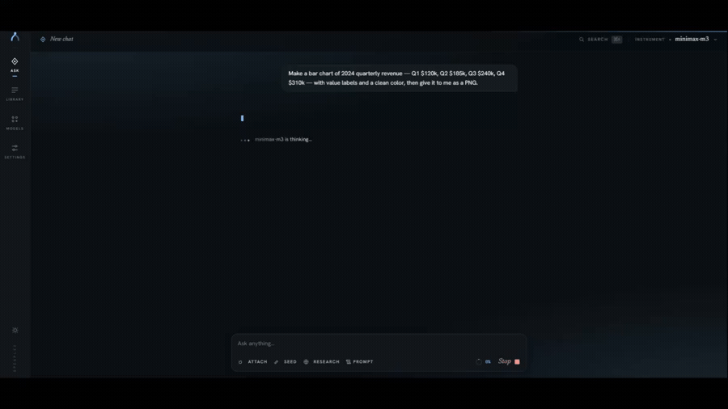
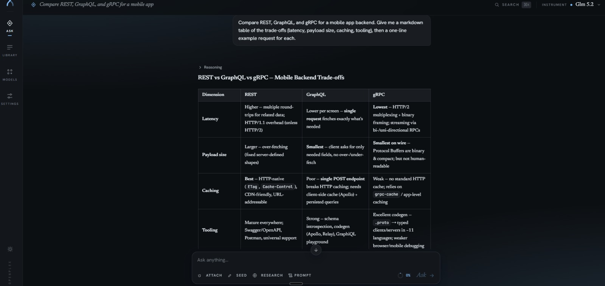
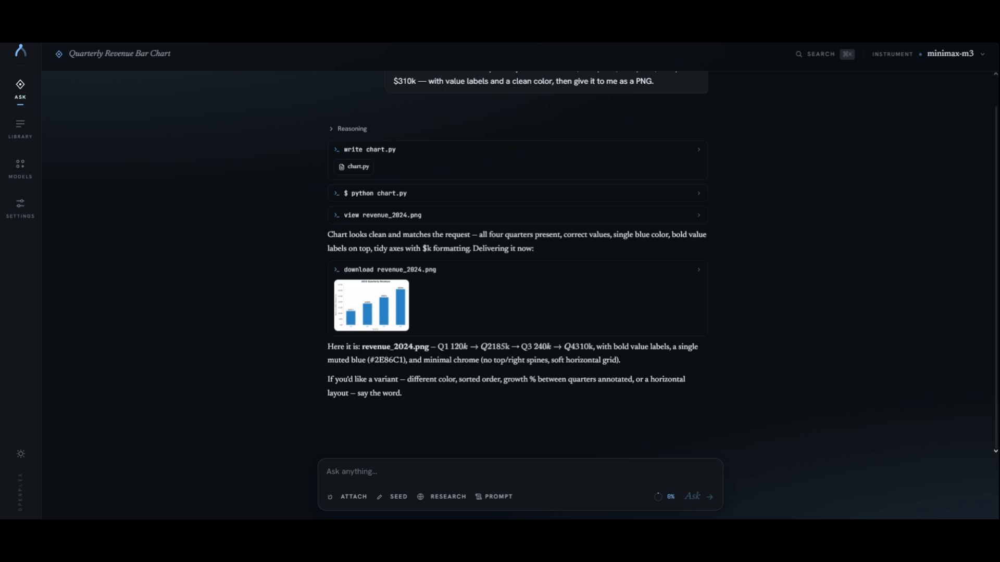
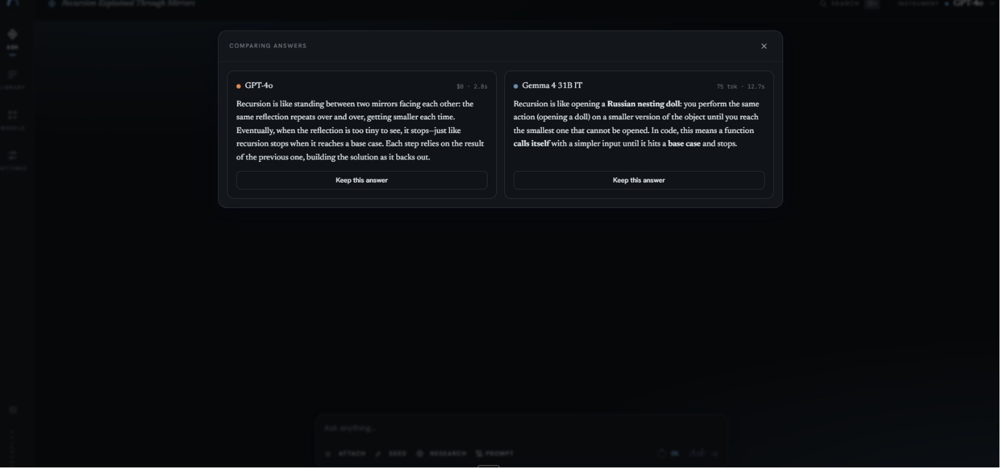
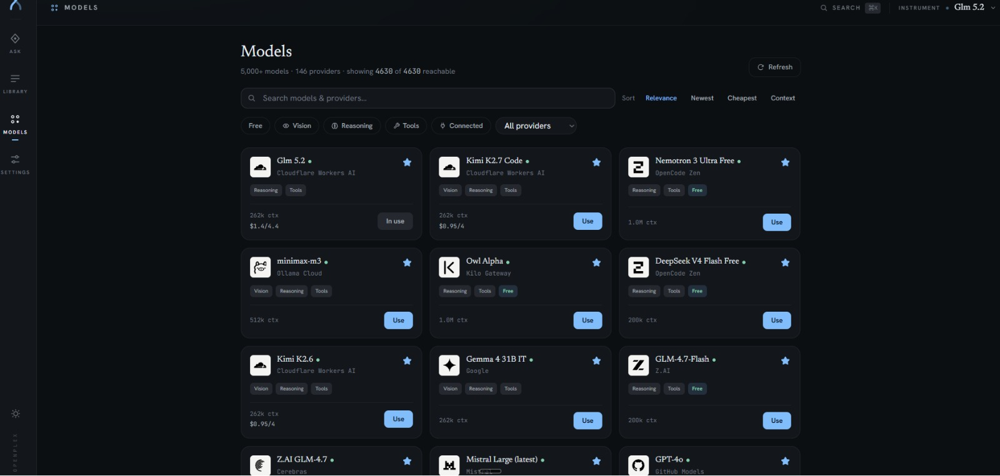
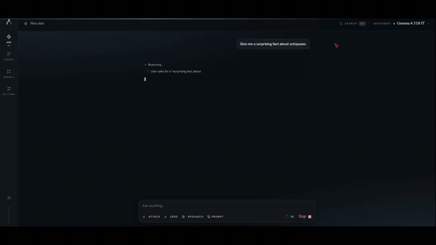
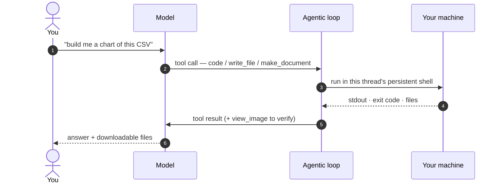
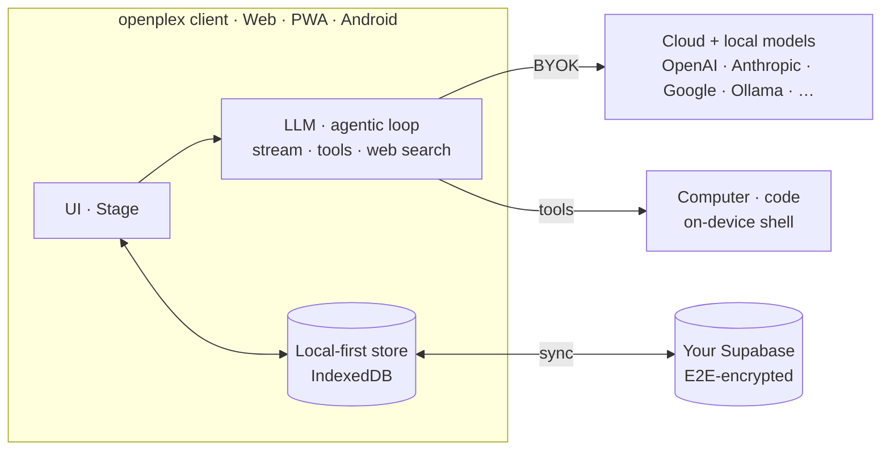

<div align="center">


# openplex

### Your keys. Every model. Now with a computer.

**openplex** is a local-first, open-source AI workspace that talks to *every* provider, searches the web with citations, compares models side by side, syncs end-to-end encrypted across your devices — and can **run code and build real files on your own machine**.

<a href="docs/demo.mp4"></a>

<sub>“Make a bar chart … as a PNG” → the agent writes &amp; runs Python → you download the file. <i>Sped up; <a href="docs/demo.mp4">watch the full clip</a>.</i></sub>

[](LICENSE)
[](package.json)
[](https://react.dev)
[](https://www.typescriptlang.org)
[](#platforms)
[](https://github.com/infiter4/openplex/stargazers)

[Quick start](#quick-start) · [Why openplex](#why-openplex) · [Features](#features) · [Computer & code](#computer--code) · [Self-repair](#self-repair) · [Sync](#cross-device-sync) · [Architecture](#architecture) · [Contributing](#contributing)

</div>

---

## Quick start

> **Requirements:** [Node.js](https://nodejs.org) 18 or newer.

```bash
git clone https://github.com/infiter4/openplex.git
cd openplex
npm install
npm run dev          # → http://localhost:43210
```

Then, in the app:

1. **Settings → Providers** — add an API key. *(OpenRouter is a great first pick: one key, 300+ models. Or click **Ollama** to use local models.)*
2. *(optional)* **Settings → Web search** — paste a free [Tavily](https://app.tavily.com) key to enable the `Web` toggle.
3. *(optional)* **Computer & code** is on by default — running via `npm run dev` already lets the agent run code and build files on this machine. See [Computer & code](#computer--code).
4. **Chat.**

No account, no backend, nothing to configure to get started.

<details>
<summary><b>Other ways to run</b></summary>

```bash
npm install -g openplex && openplex   # the prebuilt app with the CORS proxy baked in (no clone, no build)
npm run build         # type-check + production build to dist/
npm run android       # build, sync, and open the Android project (requires Android Studio)
```

</details>

---

## Why openplex

> **One app. Every model. Your keys, your data, your machine.**

openplex fuses the **opencode** philosophy — bring your own keys, every provider, local models welcome — with the **Perplexity** experience — clean threads and web search with citations — then goes further: persistent memory, end-to-end-encrypted cross-device sync, and an agent that can actually **do things** on your computer.

- **Bring your own keys.** Requests go browser → provider. No middleman server, no relay, no telemetry.
- **140+ providers** via [models.dev](https://models.dev) — switch models mid-thread; every reply is badged with the model that wrote it.
- **Compare models.** Fan one prompt out to several models and read the answers side by side.
- **Computer & code.** The agent runs terminal commands and code and produces real files — PDFs, documents, images, scripts — you download straight from chat.
- **Web search** with inline `[1][2]` citations and a sources panel.
- **Memory** that persists across chats and models.
- **Repairs itself.** When a provider moves an endpoint or retires a model, a working model diagnoses it, tests a fix, and saves one that syncs to your other devices.
- **End-to-end-encrypted sync** on your own free Supabase project — merged per field, and it asks you only when two devices truly disagree.
- **Local-first.** IndexedDB is the source of truth; fully usable offline, no account required.
- **Web, PWA, and Android** from a single codebase.

---

## Screenshots

<table>
<tr>
<td width="50%"><br/><sub><b>Every model</b> — clean threads with rich Markdown, tables &amp; code</sub></td>
<td width="50%"><br/><sub><b>Computer &amp; code</b> — it writes &amp; runs code, then hands you the file</sub></td>
</tr>
<tr>
<td><br/><sub><b>Compare</b> — one prompt, several models, side by side</sub></td>
<td><br/><sub><b>5,000+ models</b> across 146 providers, filterable</sub></td>
</tr>
</table>

---

## Features

| Feature | What it does |
|---|---|
| **Every model** | The full [models.dev](https://models.dev) catalog (140+ providers) with context windows and pricing shown next to each model, switchable mid-conversation. |
| **Your keys** | Connect providers with your own keys; calls go straight browser → provider. Optional AES-256 encrypted key sync unlocks every device with one passphrase. |
| **Compare** | Send one prompt to multiple models at once and review the responses side by side. |
| **Computer & code** | Run terminal commands and code, read/write/edit files, generate images and documents, verify its own visual output, and download anything from chat. See [below](#computer--code). |
| **Web search** | Toggle `Web` and answers cite their sources `[1][2]` Perplexity-style. Tavily, Jina, Brave, or SearXNG. |
| **Memory** | Facts about you that persist across chats and models — saved manually or auto-extracted. |
| **Thinking control** | Per-thread reasoning effort (Auto / Off / low / med / high) for capable models; reasoning folded into a collapsible section. |
| **Context & reply caps** | Per-thread context-window cap and a clickable max-reply control with a live "used / max" ring — long threads stay fast, cheap, and within every provider's limits. |
| **Files & vision** | Attach PDFs, Word docs, images, and code; view them in an in-app viewer; PDFs render to page images for vision models. Snap a photo on Android. |
| **Markdown & math** | GitHub-flavored Markdown, syntax-highlighted code, and KaTeX math. |
| **Local models** | Ollama, LM Studio, or any OpenAI-compatible endpoint (vLLM, LiteLLM, …). |
| **Voice input** | Dictate into the composer — pick any speech-to-text model from the models.dev catalog (Whisper, Qwen3-ASR, Voxtral, …) across **any** connected provider, right from the ▴ next to the mic. |
| **Self-repair** | Providers move endpoints and retire model ids without warning. Point a model that still works at the failure and it diagnoses, reads the provider's current docs, tests real requests, and saves a fix that syncs to your other devices. See [below](#self-repair). |
| **Sync** | Threads, memories, and settings converge across devices through your own free Supabase project — merged field by field, not last-writer-wins. See [below](#cross-device-sync). |

<p align="center">
  <a href="docs/demo-switch.mp4"></a>
  <br/><sub><b>Switch models mid-thread</b> — open the picker, pick any model, and every reply is badged with the one that wrote it.</sub>
</p>

---

## Computer & code

Let the agent operate your computer — run terminal commands and code, and build real files you download right from chat. It is **on by default**.



- **Runs on the PC out of the box.** `npm run dev` (or the `openplex` CLI) exposes a same-origin `/__exec` endpoint that gives the agent a real shell on this machine. No pairing, no setup.
- **Drive your PC from your phone.** Pair over your own Supabase project with a code from the desktop UI; commands queue and run on the PC, results stream back. No LAN, no exposed ports.
- **Per-thread shells.** Each chat gets its own persistent shell (cwd / env / virtualenv persist between commands), idle-reaped to stay light.
- **Real documents.** For styled output it authors HTML and renders it through a real headless browser (Chrome / Chromium / Brave) into pixel-perfect PDF / DOCX / PPTX / XLSX, with the source handed back too.
- **Sees its own work.** It can view images and PDFs it produced (vision) and verifies them before saying done.
- **Download anything.** Files from any command — images, archives, datasets — return as download chips in chat.
- **Fully transparent.** Every command, its output, and the model's reasoning stream inline, in the order the model runs them.
- **No computer? Still makes files.** With nothing paired, the model is only offered the tools that actually work, and `make_document` builds **pdf · html · md · txt · csv · json** in the browser itself — a real, selectable-text PDF on your phone, no computer involved. It is never told to ask you to "connect" or "sync" something first.

**Tools:** `terminal` · `code` · `write_file` · `edit_file` · `read_file` · `list_files` · `make_document` · `download_file` · `view_image`

Commands auto-run (no per-command prompt) and are scoped to your account. The machine has to be reachable — openplex probes it before offering the tools, rather than letting the model discover mid-answer that it can't run anything.

### Start it at login

So your phone can reach the PC without you remembering to start anything:

```bash
openplex autostart install           # opens the app at login, phone relay included
openplex autostart install --quiet   # same, but no window — it just serves and relays
openplex autostart install --agent   # phone relay only, nothing served
openplex autostart install --port 8080
openplex autostart status            # installed? and is it actually answering right now?
openplex autostart uninstall
```

Per-user, no admin and no root: a Startup-folder script on Windows, a LaunchAgent on macOS, a `systemd --user` service on Linux. `uninstall` removes exactly what it wrote.

> [!NOTE]
> The default port is **43210**, the same one `npm run dev` wants. If you develop on this machine, either run autostart on another port (`--port 8080`) or let Vite fall through to 43211.

---

## Self-repair

A BYOK client talks to providers directly, so it breaks in one specific way: a provider moves its endpoint, changes a required header, switches wire protocol, or retires a model id — and suddenly chats just fail. openplex can fix that itself.

Hit **Fix this** on a failed message (or **Settings → Repair**, or `Ctrl + K` → "Repair a broken provider"), pick a model you know still works, and it:

1. Reads the provider's current config and **reproduces the failure** with a real request, so it diagnoses from the provider's own error body rather than the error message.
2. **Searches the web** and reads the provider's docs and changelog.
3. **Tests every candidate** — new base URL, new model id, different API style or headers — before touching anything.
4. **Saves the repair and re-verifies it.** "Fixed" means a request actually succeeded, not that the model said so.

Repairs are stored as data — base URL, API style, extra headers, model-id aliases — so they **sync to your phone**, where editing source would be impossible. Credentials are never written into one. When your computer is reachable it also gets `read_file` / `edit_file` / `terminal` for bugs no override can reach, and it will tell you a source edit needs a rebuild and won't reach your phone.

Saved repairs are listed under **Settings → Repair**, with what changed and why, and can be removed one by one.

---

## How it compares

| Capability | openplex | ChatGPT | Perplexity | LM Studio |
|---|:--:|:--:|:--:|:--:|
| Any model, any provider (BYOK) | ✓ | ✗ | ✗ | local only |
| Switch and compare models mid-thread | ✓ | ✗ | ✗ | ✗ |
| Web search with citations | ✓ | ✓ | ✓ | ✗ |
| Runs code & builds files on your machine | ✓ | ~ | ✗ | ✗ |
| Local models (Ollama / LM Studio) | ✓ | ✗ | ✗ | ✓ |
| Persistent cross-chat memory | ✓ | ✓ | ~ | ✗ |
| Sync end-to-end encrypted on infra you own | ✓ | ✗ | ✗ | ✗ |
| Open source & self-hostable | ✓ | ✗ | ✗ | ✗ |
| Native mobile app | ✓ | ✓ | ✓ | ✗ |

<sub>✓ yes · ~ partial or cloud-sandboxed · ✗ no. A fair, high-level guide based on typical consumer tiers.</sub>

---

## Cross-device sync

openplex syncs through a Supabase project **you** own (free, about five minutes):

1. Create a project at [supabase.com](https://supabase.com).
2. In the project's **SQL editor**, paste and run [`supabase/schema.sql`](supabase/schema.sql).
3. Copy your **Project URL** and **anon public key** (*Project Settings → API*) into **Settings → Account & sync**.
4. Sign in with the email magic link, or enable Supabase's **Google provider** for one-click sign-in.

- Every device signs into the same account; threads, messages, memories, and settings converge.
- **Changes merge instead of overwriting.** Each record keeps a copy of what the server last held, so openplex can tell *changed here* from *unchanged here*: rename a chat on your phone while the PC edits its system prompt and you keep both. Deletions stick, provider repairs and prompt presets merge entry by entry, and settings merge key by key rather than one device's blob replacing the other's.
- **When a merge genuinely isn't possible, you choose.** If both devices changed the same field to different values, that record is held out of sync and shown side by side — *This device* vs *Your other device*, only the fields that differ. Pick a version; everything else was merged already. Reachable any time from **Settings → Account & devices**.
- **API keys sync only if you opt in** — they are encrypted on-device (AES-256 with your passphrase) before upload, so the database only ever stores ciphertext.
- Realtime is enabled by the schema; without it the app polls on focus and every 60 seconds.
- Preconfigure sync for all visitors with `VITE_SUPABASE_URL` and `VITE_SUPABASE_ANON_KEY` at build time (see [`.env.example`](.env.example)).

---

## Platforms

| Platform | Status | Notes |
|---|---|---|
| **Web** | Stable | `npm run dev`, or deploy to any static host. |
| **PWA** | Stable | "Add to Home Screen" gives an installable app on any OS today. |
| **Android** | Stable | Native app via Capacitor — status-bar theming, splash, hardware back, deep-link sign-in, safe-area insets, in-app camera capture, voice dictation. **[Download the APK](https://github.com/infiter4/openplex/raw/main/docs/openplex.apk)** (also in-app under **Settings → Account & sync**), or build it with `npm run android`. |
| **iOS** | Ready | The codebase is iOS-ready; on a Mac run `npm i @capacitor/ios && npx cap add ios`. |

Sync flows through the same Supabase backend everywhere, so web and phone stay identical.

---

## Install the CLI

```bash
npm install -g openplex
openplex              # serves the prebuilt app at http://localhost:43210 and opens it
```

Ships the app with the CORS proxy built in, so every provider — and local Ollama / LM Studio — works with zero setup. It is a single zero-dependency Node server, and your keys still live only in your browser.

```bash
openplex agent                # phone ↔ PC compute relay only
openplex --port 8080          # serve somewhere else
openplex --no-open            # serve without opening a browser
openplex autostart install    # start it at login (see Computer & code)
```

It binds both loopback families, so `localhost`, `127.0.0.1`, and `[::1]` all reach it.

---

## CORS & local models

A pure browser app cannot call APIs or servers that do not send CORS headers (Ollama, LM Studio, Brave, SearXNG, some providers). openplex handles this transparently:

- **`npm run dev`** — every provider and local call is auto-proxied through the Vite dev server (`/__cors`). Zero setup.
- **Deployed (static host)** — CORS-friendly providers (OpenAI, Anthropic, Google, OpenRouter, Groq, Mistral, …) work directly; for the rest, run the bundled proxy (`node proxy/server.mjs`) or deploy [`proxy/worker.js`](proxy/worker.js) to a Cloudflare Worker and set it in **Settings → Providers → Connection**.
- **Mobile** — non-streaming calls use Capacitor native HTTP (no CORS); strict or Cloudflare-fronted providers route through your proxy.

> [!WARNING]
> Before deploying the Worker, edit [`proxy/worker.js`](proxy/worker.js) and set `SECRET` to your own random string — it refuses to serve until you do, so it never becomes an open relay.

```bash
OLLAMA_ORIGINS=* ollama serve   # reach Ollama directly, without the proxy
```

---

## Architecture

Local-first by design: **IndexedDB (Dexie) is the source of truth**, and sync is layered on top with dirty-flags, tombstones, and a three-way merge against a per-record shadow of the last synced state. A single Zustand store (`useStore`) is the backbone the whole UI hangs off.



```text
src/
  lib/         types · Dexie DB · models.dev catalog · provider endpoint map + repair overrides
               streaming LLM clients (OpenAI / Anthropic / Cohere) · agentic tool-use loop
               web search · prompt assembly · Supabase client · file processing
               heal (repair agent) · localDocs (browser PDF/HTML) · merge + sync engine
  state/       Zustand stores — app (threads/messages/streaming/sync), settings, providers, conflicts
  components/  Sidebar · Stage · Composer · ModelPicker · MessageView · Markdown · Settings tabs
bin/           openplex CLI (static server + CORS proxy) · agent compute runner · shared executor
               autostart (login item / LaunchAgent / systemd user unit)
proxy/         standalone CORS proxy (Node + Cloudflare Worker)
android/       Capacitor Android project
supabase/      schema.sql for the sync backend
```

Core abstractions (most-connected modules): `useStore`, `useSettings`, `useProviders`, `streamChat`, `corsFetch`, `streamChatAgentic`.

---

## Tech stack

**React 19** · **TypeScript** · **Vite 6** · **Tailwind CSS v4** · **Zustand** · **Dexie (IndexedDB)** · **Capacitor 8** · **Supabase** · **KaTeX** · **pdf.js** · **mammoth** · **Vitest**

---

## Keyboard shortcuts

| Shortcut | Action |  | Shortcut | Action |
|---|---|---|---|---|
| `Ctrl + K` | Command palette & search |  | `Ctrl + B` | Toggle sidebar |
| `Ctrl + Shift + O` | New chat |  | `↑` | Recall last message |
| `Enter` | Send |  | `Shift + Enter` | Newline |

---

## Privacy & security

- API keys live in **your browser** (`localStorage`) and are sent **only** to the provider you call.
- Sync and the agent run on **your own** Supabase project — there are no openplex servers, ever.
- Synced keys are AES-256-encrypted with a passphrase that never leaves your devices; the database only stores ciphertext.
- The optional Cloudflare proxy is secret-gated, so it cannot become an open relay.

Found a vulnerability? Please report it privately via [Security Advisories](https://github.com/infiter4/openplex/security/advisories/new) rather than a public issue.

---

## Contributing

Contributions are welcome and appreciated. To get set up:

```bash
npm install
npm run dev          # http://localhost:43210
npm run typecheck    # tsc --noEmit
npm run lint         # eslint
npm run test         # vitest
```

Issues and focused PRs are welcome — please run `npm run typecheck`, `npm run lint`, and `npm test` before pushing.

---

## License

[MIT](LICENSE) © openplex contributors

<div align="center">
<sub>Built for people who want every model, their own keys, and their own computer — without a middleman.</sub>
<br/><br/>
<b><a href="https://github.com/infiter4/openplex">Star the repo</a></b> if openplex is useful to you — it genuinely helps.
</div>
